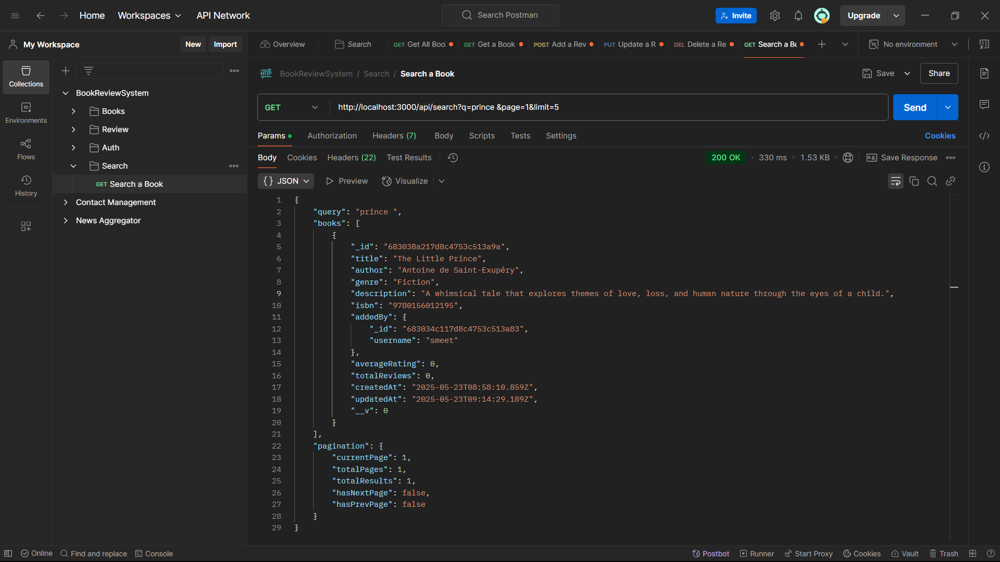

<<<<<<< HEAD

# Book Review API

This project is a backend system for managing books, reviews, and users.
=======
# Book Review API

A comprehensive RESTful API for managing books and reviews with JWT authentication, built with Node.js, Express, and MongoDB.

## 🚀 Features

- **Authentication**: JWT-based user registration and login
- **Book Management**: CRUD operations for books with metadata
- **Review System**: Users can add, update, and delete reviews (one per book)
- **Search**: Case-insensitive search by book title or author
- **Advanced Filtering**: Filter books by author and genre
- **Pagination**: All list endpoints support pagination
- **Rating System**: Automatic calculation of average ratings
- **Security**: Rate limiting, input validation, and secure headers

## 📁 Project Structure

```
book-review-api/
├── server.js                 # Application entry point
├── package.json              # Dependencies and scripts
├── .env                      # Environment variables
├── models/
│   ├── User.js              # User schema and methods
│   ├── Book.js              # Book schema and indexes
│   └── Review.js            # Review schema with rating logic
├── routes/
│   ├── auth.js              # Authentication endpoints
│   ├── books.js             # Book CRUD and review addition
│   ├── reviews.js           # Review update/delete
│   └── search.js            # Search functionality
├── middleware/
│   ├── auth.js              # JWT authentication middleware
│   ├── errorHandler.js      # Global error handling
│   └── validation.js        # Input validation rules
└── README.md                # This file
```

## 🛠️ Setup Instructions

### Prerequisites

- Node.js (v16 or higher)
- MongoDB (local installation or MongoDB Atlas)
- npm or yarn package manager

### Installation

1. **Clone the repository**
   ```bash
   git clone <repository-url>
   cd book-review-api
   ```

2. **Install dependencies**
   ```bash
   npm install
   ```

3. **Environment Setup**
   Create a `.env` file in the root directory:
   ```env
   PORT=3000
   MONGODB_URI=mongodb://localhost:27017/book-review-db
   JWT_SECRET=your-super-secret-jwt-key-change-this-in-production
   JWT_EXPIRE=7d
   NODE_ENV=development
   ```

4. **Start MongoDB**
   - **Local MongoDB**: Ensure MongoDB service is running
   - **MongoDB Atlas**: Update `MONGODB_URI` with your Atlas connection string

5. **Run the application**
   ```bash
   # Development mode with auto-restart
   npm run dev
   
   # Production mode
   npm start
   ```

6. **Verify installation**
   Visit `http://localhost:3000/health` - you should see:
   ```json
   {
     "status": "OK",
     "timestamp": "2025-05-23T10:30:00.000Z"
   }
   ```

## 📊 Database Schema

### User Schema
```javascript
{
  username: String (required, unique, 3-30 chars)
  email: String (required, unique, valid email)
  password: String (required, min 6 chars, hashed)
  role: String (enum: ['user', 'admin'], default: 'user')
  createdAt: Date
  updatedAt: Date
}
```

### Book Schema
```javascript
{
  title: String (required, max 200 chars)
  author: String (required, max 100 chars)
  genre: String (required, max 50 chars)
  description: String (optional, max 2000 chars)
  isbn: String (optional, unique, validated format)
  publishedYear: Number (optional, 1000-current year)
  pages: Number (optional, min 1)
  addedBy: ObjectId (ref: User, required)
  averageRating: Number (0-5, calculated automatically)
  totalReviews: Number (calculated automatically)
  createdAt: Date
  updatedAt: Date
}
```

### Review Schema
```javascript
{
  book: ObjectId (ref: Book, required)
  user: ObjectId (ref: User, required)
  rating: Number (required, 1-5)
  comment: String (optional, max 1000 chars)
  createdAt: Date
  updatedAt: Date
}
```

**Unique Constraint**: One review per user per book (`book + user` composite index)

## 🔌 API Endpoints

### Authentication

#### Register User
```http
POST /api/auth/signup
Content-Type: application/json

{
  "username": "johndoe",
  "email": "john@example.com",
  "password": "password123"
}
```

**Response:**
```json
{
  "message": "User registered successfully",
  "token": "jwt-token-here",
  "user": {
    "id": "user-id",
    "username": "johndoe",
    "email": "john@example.com",
    "role": "user"
  }
}
```

#### Login User
```http
POST /api/auth/login
Content-Type: application/json

{
  "email": "john@example.com",
  "password": "password123"
}
```

**Response:**
```json
{
  "message": "Login successful",
  "token": "jwt-token-here",
  "user": {
    "id": "user-id",
    "username": "johndoe",
    "email": "john@example.com",
    "role": "user"
  }
}
```

### Books

#### Add New Book
```http
POST /api/books
Authorization: Bearer <jwt-token>
Content-Type: application/json

{
  "title": "The Great Gatsby",
  "author": "F. Scott Fitzgerald",
  "genre": "Classic Literature",
  "description": "A classic American novel set in the Jazz Age",
  "isbn": "978-0-7432-7356-5",
  "publishedYear": 1925,
  "pages": 180
}
```

#### Get All Books (with filtering and pagination)
```http
GET /api/books?page=1&limit=10&author=Fitzgerald&genre=Classic&sortBy=averageRating&sortOrder=desc
```

**Query Parameters:**
- `page`: Page number (default: 1)
- `limit`: Items per page (default: 10, max: 100)
- `author`: Filter by author (case-insensitive partial match)
- `genre`: Filter by genre (case-insensitive partial match)
- `sortBy`: Sort field (title, author, averageRating, createdAt)
- `sortOrder`: Sort direction (asc, desc)

**Response:**
```json
{
  "books": [
    {
      "_id": "book-id",
      "title": "The Great Gatsby",
      "author": "F. Scott Fitzgerald",
      "genre": "Classic Literature",
      "averageRating": 4.2,
      "totalReviews": 15,
      "addedBy": {
        "_id": "user-id",
        "username": "johndoe"
      },
      "createdAt": "2025-05-23T10:00:00.000Z"
    }
  ],
  "pagination": {
    "currentPage": 1,
    "totalPages": 5,
    "totalBooks": 50,
    "hasNextPage": true,
    "hasPrevPage": false
  }
}
```

#### Get Book by ID (with reviews)
```http
GET /api/books/:id?page=1&limit=5
```

**Response:**
```json
{
  "book": {
    "_id": "book-id",
    "title": "The Great Gatsby",
    "author": "F. Scott Fitzgerald",
    "genre": "Classic Literature",
    "description": "A classic American novel...",
    "averageRating": 4.2,
    "totalReviews": 15,
    "addedBy": {
      "_id": "user-id",
      "username": "johndoe"
    }
  },
  "reviews": [
    {
      "_id": "review-id",
      "rating": 5,
      "comment": "Excellent book!",
      "user": {
        "_id": "user-id",
        "username": "reviewer"
      },
      "createdAt": "2025-05-23T09:00:00.000Z"
    }
  ],
  "reviewsPagination": {
    "currentPage": 1,
    "totalPages": 3,
    "totalReviews": 15,
    "hasNextPage": true,
    "hasPrevPage": false
  }
}
```

#### Add Review to Book
```http
POST /api/books/:id/reviews
Authorization: Bearer <jwt-token>
Content-Type: application/json

{
  "rating": 5,
  "comment": "Absolutely loved this book! Fitzgerald's prose is beautiful."
}
```

### Reviews

#### Update Review
```http
PUT /api/reviews/:id
Authorization: Bearer <jwt-token>
Content-Type: application/json

{
  "rating": 4,
  "comment": "Updated my review after re-reading."
}
```

#### Delete Review
```http
DELETE /api/reviews/:id
Authorization: Bearer <jwt-token>
```

### Search

#### Search Books
```http
GET /api/search?q=gatsby&page=1&limit=10
```

**Query Parameters:**
- `q`: Search query (min 2 characters, searches title and author)
- `page`: Page number (default: 1)
- `limit`: Items per page (default: 10, max: 100)

**Response:**
```json
{
  "query": "gatsby",
  "books": [
    {
      "_id": "book-id",
      "title": "The Great Gatsby",
      "author": "F. Scott Fitzgerald",
      "genre": "Classic Literature",
      "averageRating": 4.2,
      "totalReviews": 15
    }
  ],
  "pagination": {
    "currentPage": 1,
    "totalPages": 1,
    "totalResults": 1,
    "hasNextPage": false,
    "hasPrevPage": false
  }
}
```

## 🔒 Authentication

All protected endpoints require a JWT token in the Authorization header:

```http
Authorization: Bearer <your-jwt-token>
```

Tokens are returned upon successful login/signup and expire in 7 days (configurable via `JWT_EXPIRE`).

## ⚡ Key Features Explained

### Automatic Rating Calculation
- When a review is added, updated, or deleted, the book's `averageRating` and `totalReviews` are automatically recalculated
- Uses MongoDB aggregation pipeline for accurate calculations
- Ratings are rounded to 1 decimal place

### One Review Per User Per Book
- Database constraint prevents multiple reviews from the same user for the same book
- Users can update or delete their existing review
- Attempting to add a duplicate review returns a 400 error

### Efficient Search
- Text indexes on book `title` and `author` fields for fast searching
- Case-insensitive partial matching using regex
- Results sorted by rating and review count for relevance

### Security Features
- Password hashing using bcryptjs
- JWT token expiration
- Rate limiting (100 requests per 15 minutes per IP)
- Input validation and sanitization
- Helmet.js for security headers
- CORS support for cross-origin requests

## 📝 Example Usage Flow

1. **Register a new user**
   ```bash
   curl -X POST http://localhost:3000/api/auth/signup \
     -H "Content-Type: application/json" \
     -d '{"username":"bookworm","email":"book@example.com","password":"reading123"}'
   ```

2. **Add a book** (use token from step 1)
   ```bash
   curl -X POST http://localhost:3000/api/books \
     -H "Authorization: Bearer YOUR_TOKEN" \
     -H "Content-Type: application/json" \
     -d '{"title":"1984","author":"George Orwell","genre":"Dystopian Fiction"}'
   ```

3. **Search for books**
   ```bash
   curl "http://localhost:3000/api/search?q=orwell"
   ```

4. **Add a review** (use book ID from step 2)
   ```bash
   curl -X POST http://localhost:3000/api/books/BOOK_ID/reviews \
     -H "Authorization: Bearer YOUR_TOKEN" \
     -H "Content-Type: application/json" \
     -d '{"rating":5,"comment":"Masterpiece of literature!"}'
   ```

## 🔧 Design Decisions & Assumptions

### Database Choice
- **MongoDB** chosen for flexibility with book metadata and easy scaling
- **Mongoose** provides schema validation and relationship management
- Text indexes for efficient search functionality

### Authentication Strategy
- **JWT tokens** for stateless authentication
- **bcryptjs** for secure password hashing
- **7-day token expiration** balancing security and user experience

### Review System Design
- **One review per user per book** to prevent spam and maintain integrity
- **Automatic rating calculation** ensures consistency
- **Soft validation** on comment length (1000 chars) for reasonable feedback

### API Design Principles
- **RESTful endpoints** following HTTP conventions
- **Consistent error responses** with appropriate status codes
- **Pagination on all list endpoints** to handle large datasets
- **Input validation** using express-validator for security

### Performance Optimizations
- **Database indexes** on frequently queried fields
- **Population limits** to avoid over-fetching related data
- **Aggregation pipelines** for efficient rating calculations
- **Rate limiting** to prevent abuse

## 🚨 Error Handling

The API returns consistent error responses:

```json
{
  "message": "Error description",
  "errors": [
    {
      "field": "fieldName",
      "message": "Specific validation error"
    }
  ]
}
```

Common HTTP status codes:
- `200`: Success
- `201`: Created successfully
- `400`: Bad request (validation errors)
- `401`: Unauthorized (invalid/missing token)
- `403`: Forbidden (insufficient permissions)
- `404`: Resource not found
- `429`: Too many requests (rate limit exceeded)
- `500`: Internal server error

## 🔄 Future Enhancements

- **Book categories/tags system** for better organization
- **User profiles** with reading history and preferences
- **Advanced search filters** (publication year, rating range, etc.)
- **Book recommendations** based on user reviews
- **Admin panel** for content moderation
- **File upload** for book covers
- **Social features** (follow users, like reviews)
- **API versioning** for backward compatibility

## 🤝 Contributing

1. Fork the repository
2. Create a feature branch (`git checkout -b feature/new-feature`)
3. Commit changes (`git commit -am 'Add new feature'`)
4. Push to branch (`git push origin feature/new-feature`)
5. Create a Pull Request

## 📸 Screenshots

<<<<<<< HEAD
This project is licensed under the MIT License.
>>>>>>> 28b25b7 (Initial Commit)
=======
### Auth


### Book


### Review


### Search Books


>>>>>>> 5727b7d (Finishing Project)
